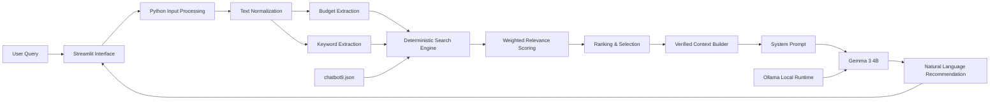

# Teman Makan Tangsel

**Local-First Culinary Recommendation Chatbot powered by Gemma 3 4B, Ollama, Streamlit, and deterministic data filtering.**

Teman Makan Tangsel is a local AI-powered culinary recommendation chatbot designed to help users discover restaurants and cafés across South Tangerang, Indonesia.

Unlike a conventional chatbot that relies entirely on a Large Language Model to retrieve factual information, this project uses a **hybrid architecture**:

1. Python deterministically searches and ranks verified culinary data.
2. Only the most relevant records are passed to the language model.
3. Gemma 3 4B converts the verified context into a natural conversational response.

The system was developed as an Artificial Intelligence academic project at **Institut Teknologi Tangerang Selatan (ITTS)**.

---

## Project Overview

South Tangerang has a rapidly growing culinary ecosystem, which can make choosing a restaurant surprisingly inconvenient.

Teman Makan Tangsel addresses this problem through a conversational recommendation interface capable of understanding queries involving:

- Location
- Food category
- Price or budget
- Restaurant characteristics
- User intent
- General culinary recommendations

The current culinary knowledge base contains **276 restaurant and café entities** across South Tangerang.

Instead of allowing Gemma to directly search or invent restaurant information, the application retrieves records from a structured JSON database first and uses those records as the model's factual context.

---

## Key Features

- Local LLM inference using **Gemma 3 4B**
- Runs through **Ollama**
- Interactive chat interface built with **Streamlit**
- 276 structured culinary entities
- Deterministic keyword-based search
- Weighted relevance scoring
- Budget extraction using regular expressions
- Location and category matching
- Ranking by relevance and restaurant rating
- Grounded LLM responses
- Temperature set to `0` for more deterministic generation
- Explicit fallback when matching data is unavailable
- Chat session history
- Admin dashboard
- Culinary dataset distribution visualization
- Fully local inference after initial setup
- No external cloud LLM API required

---

## System Architecture



The important architectural principle is:

> **Python retrieves the facts. Gemma explains the facts.**

The language model does not directly search the restaurant database.

This separation reduces the probability of fabricated restaurant information and makes data retrieval easier to inspect and verify.

---

## How the Recommendation Pipeline Works

### 1. User Input

The user submits a natural-language query through Streamlit.

Example:

```text
Cari tempat makan murah di BSD budget 50 ribu
```

### 2. Query Normalization

The application:

- converts the query to lowercase,
- removes unnecessary words,
- identifies meaningful keywords,
- detects greeting-only queries,
- determines whether the user requests a list.

### 3. Budget Extraction

Regular expressions are used to detect numeric budget information.

For example:

```text
budget 50 ribu
```

is interpreted as approximately:

```text
50000
```

### 4. Deterministic Filtering

Every culinary entity in the JSON database is evaluated against the query.

The search pool includes information such as:

- restaurant name,
- area,
- category,
- tags,
- special features,
- price classification,
- search aliases.

Relevant keyword matches receive weighted scores.

### 5. Ranking

Candidate restaurants are ranked by:

1. relevance score,
2. restaurant rating.

The application currently returns:

- up to **4 results** for normal recommendations,
- up to **10 results** when the user explicitly requests a list or multiple recommendations.

### 6. Context Grounding

Only selected database records are inserted into the LLM context.

The context can contain:

- restaurant name,
- price category,
- rating,
- address,
- price range,
- short description.

### 7. Local LLM Generation

The verified context and original user query are sent to:

```text
gemma3:4b
```

through Ollama.

The application uses:

```python
options={"temperature": 0}
```

to encourage more deterministic responses.

Gemma then transforms the structured results into a conversational Indonesian recommendation.

---

## Technology Stack

| Component | Technology |
|---|---|
| Programming Language | Python |
| Web Framework | Streamlit |
| Local LLM | Gemma 3 4B |
| Inference Runtime | Ollama |
| Database | JSON |
| Data Processing | Pandas |
| Query Processing | Python `re` / Regular Expressions |
| Primary OS during evaluation | Ubuntu 24.04 LTS |
| Evaluation GPU | NVIDIA GeForce RTX 3050 Laptop GPU |
| Evaluation RAM | 16 GB DDR4 |

The academic implementation was developed using **Python 3.12**.

---

## Dataset

The project uses a structured culinary dataset containing approximately **276 restaurant and café entities across South Tangerang**.

The current application loads:

```text
chatbot9.json
```

Each entry contains information similar to:

```json
{
  "name": "Kopi Nako",
  "area": "BSD",
  "category": "Kopi",
  "tags": [
    "outdoor",
    "estetik",
    "nugas",
    "sunset"
  ],
  "Price": "35.000 - 80.000",
  "rating": 4.6,
  "address": "Jl. Edutown, BSD City",
  "recommended_for": [
    "anak muda",
    "nugas",
    "nongkrong sore"
  ],
  "opening_time_hint": "Buka 24 Jam",
  "special_feature": "Tempatnya luas dan estetik, enak buat nugas atau nongkrong sore.",
  "klasifikasi": {
    "tag": "Mid",
    "search_keywords": [
      "mid",
      "sedang",
      "normal",
      "menengah"
    ]
  }
}
```

The dataset is intentionally separated from the application logic, allowing restaurant data to be updated without retraining the language model.

---

## Repository Structure

```text
.
├── app.py
├── chatbot8.json
├── chatbot9.json
├── Tutorial dan troubleshooting.md
├── Penjelasan alur kerja dalam visualiasi(file html).html
├── Penjelasan alur kerja dalam visualiasi.jpg
└── .gitignore
```

### Important Files

**`app.py`**

Main Streamlit application containing:

- user interface,
- session management,
- deterministic search engine,
- relevance scoring,
- budget parsing,
- context construction,
- Ollama integration,
- Gemma system prompt.

**`chatbot9.json`**

Current structured culinary knowledge base used by the application.

**`chatbot8.json`**

Earlier version of the culinary dataset retained as part of the project history.

**`Tutorial dan troubleshooting.md`**

Detailed installation, execution, and troubleshooting documentation.

**System visualization files**

Provide an additional visual explanation of the application's processing pipeline.

---

# Installation

## 1. Clone the Repository

```bash
git clone https://github.com/Lintangarif/-UAS_Kelompok13_Teman-Makan-Tangsel_gemma3_4B_local-chatbot.git teman-makan-tangsel
cd teman-makan-tangsel
```

Using a custom destination directory avoids having to work with the repository's original directory name beginning with a hyphen.

---

## 2. Create a Virtual Environment

### Windows

```bash
python -m venv venv
venv\Scripts\activate
```

### Linux / macOS

```bash
python3 -m venv venv
source venv/bin/activate
```

---

## 3. Install Python Dependencies

The current repository does not contain a `requirements.txt`, so install the required packages manually:

```bash
pip install streamlit ollama pandas
```

The remaining modules used by the application, including `json`, `os`, and `re`, are part of the Python standard library.

---

## 4. Install Ollama

Install Ollama from its official distribution for your operating system.

Verify the installation:

```bash
ollama --version
```

---

## 5. Download Gemma 3 4B

```bash
ollama pull gemma3:4b
```

Verify that the model is available:

```bash
ollama list
```

You should see:

```text
gemma3:4b
```

You can also test it directly:

```bash
ollama run gemma3:4b
```

---

# Running the Application

Make sure Ollama is running.

Then start Streamlit:

```bash
streamlit run app.py
```

Streamlit will normally expose the interface at:

```text
http://localhost:8501
```

Open the address in your browser.

---

## Example Queries

Try queries such as:

```text
Cari cafe murah di BSD
```

```text
Ada tempat makan di Bintaro?
```

```text
Rekomendasi tempat nongkrong budget 50 ribu
```

```text
Cari kopi yang enak buat nugas
```

```text
Daftar restoran murah di Tangsel
```

```text
Ada makanan Jepang di BSD?
```

If no matching verified record exists, the chatbot is instructed to state that the requested information is unavailable rather than intentionally inventing a restaurant.

---

# Search and Ranking Logic

The system assigns different weights to different types of matches.

Conceptually:

```text
Exact query match        -> high score
Price category match     -> high score
Search keyword match     -> high score
Food category match      -> medium score
Restaurant name match    -> medium score
General metadata match   -> additional score
Budget compatibility     -> additional score
```

Candidates below the minimum relevance threshold are removed.

Matching entries are then sorted using:

```python
(score, rating)
```

in descending order.

This deterministic layer makes recommendation retrieval substantially easier to audit than asking the language model to independently remember or discover restaurant information.

---

# Local-First Design

One of the main goals of this project is to demonstrate that a specialized AI assistant can operate locally without requiring a commercial cloud LLM API.

The evaluated environment used:

- Ubuntu 24.04 LTS
- NVIDIA GeForce RTX 3050 Laptop GPU
- 4 GB VRAM
- 16 GB RAM
- Gemma 3 4B
- Ollama
- Streamlit

Project monitoring recorded approximately:

```text
GPU VRAM usage : ~3492 MiB
GPU power      : ~43 W
```

A later project workflow benchmark documented total response time at approximately:

```text
~10.6 seconds
```

on the evaluated RTX 3050 environment.

Actual performance depends on hardware, model version, operating system, background workloads, and Ollama configuration.

---

# Evaluation

The accompanying research evaluated the chatbot using black-box testing against the structured culinary database.

The reported evaluation achieved:

```text
100% matching accuracy
```

for the tested geographical and category-based retrieval cases.

This result should be interpreted as the outcome of the evaluated test cases rather than a guarantee that every possible future query will always produce a perfect response.

The architecture is designed to reduce hallucination risk by restricting factual retrieval to verified JSON records, but generated natural-language output should still be treated as model-generated text.

---

# Why Not Let the LLM Search Everything?

An early implementation relied more heavily on a general-purpose LLM interface.

That approach provided less control over how external culinary data was retrieved and increased the risk of generalized or unsupported recommendations.

The project therefore adopted a hybrid architecture:

```text
Deterministic software
        +
Probabilistic language model
```

Rather than:

```text
Language model does everything
```

This allows each component to perform the task for which it is better suited:

```text
Python
→ filtering
→ validation
→ ranking
→ numerical rules

Gemma
→ language understanding
→ conversational formatting
→ natural response generation
```

---

# Limitations

The current implementation still has several limitations.

### Dataset Distribution

The dataset is geographically imbalanced, with a large portion of entries concentrated in BSD.

Future datasets should contain more balanced representation from:

- Bintaro
- Ciputat
- Pamulang
- Serpong
- Setu
- Pondok Aren
- other South Tangerang areas.

### Keyword-Based Retrieval

The search engine currently relies primarily on deterministic keyword matching rather than semantic embeddings.

Queries using unusual synonyms or highly ambiguous language may therefore produce weaker matches.

### Static Knowledge Base

Restaurant availability, menus, prices, opening hours, and ratings can change over time.

The JSON dataset must be maintained manually to keep information current.

### Local Hardware Requirements

Gemma 3 4B can require substantial memory and may run slowly on systems without adequate GPU acceleration.

### Generated Language

Although factual context is restricted before inference, Gemma remains a generative model. The architecture reduces hallucination risk but does not constitute a formal guarantee that generated wording can never contain an error.

---

# Future Development

Potential extensions include:

- semantic retrieval,
- vector database integration,
- Retrieval-Augmented Generation,
- larger culinary datasets,
- automatic dataset validation,
- GIS integration,
- interactive maps,
- distance-aware recommendations,
- structured restaurant filtering,
- automated evaluation tests,
- improved query intent extraction,
- dynamic restaurant information updates.

For substantially larger datasets, a hybrid deterministic + semantic retrieval architecture could replace the current purely keyword-oriented retrieval layer.

---

# Research Background

This repository accompanies the research project:

**“Optimizing Local Culinary Recommendation Chatbot Using Gemma 3 4B”**

The research investigates a local-first architecture where deterministic data retrieval is separated from probabilistic language generation to improve factual grounding in a regional culinary recommendation system.

The study evaluates the system using a South Tangerang culinary dataset and consumer-grade local hardware.

---

# Team

**Kelompok 13 — Institut Teknologi Tangerang Selatan**

| Name | Student ID |
|---|---|
| Panji Arya Soma | 1003240008 |
| Lintang Arif Setianda | 1003240023 |
| Bayu Dwi H. | 1003240004 |

---

# Academic Context

Developed as part of an Artificial Intelligence course project at:

**Institut Teknologi Tangerang Selatan (ITTS)**  
South Tangerang, Indonesia

2026.

---

# License

This project is licensed under the **MIT License**. See the [`LICENSE`](LICENSE) file for details.

---

## Acknowledgements

This project uses:

- **Gemma** for local language generation
- **Ollama** for local model inference
- **Streamlit** for the conversational web interface
- **Python** for deterministic search and application logic
- **Pandas** for culinary dataset processing

---

## Project Principle

> **Retrieve deterministically. Generate conversationally.**

Teman Makan Tangsel demonstrates that a useful domain-specific AI assistant does not require giving the language model control over every part of the system. Reliable software can retrieve the facts, while the LLM focuses on communicating them naturally.
